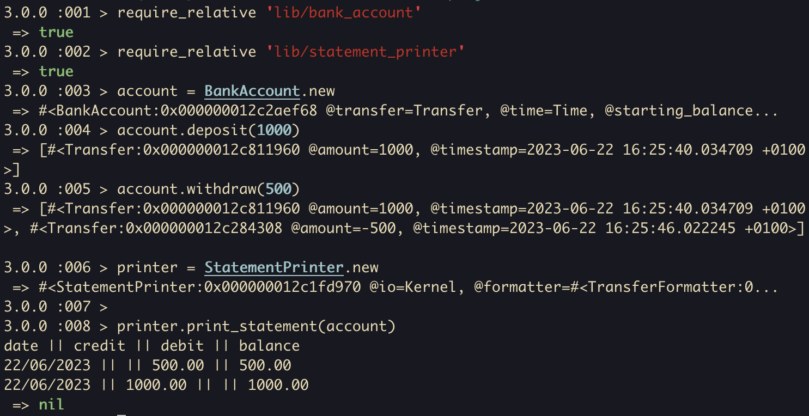

# Bank tech test

A practice tech test for week 10 of Makers Academy. The program provides a bank account that users can deposit into and withdraw from. A user can then see a statement with a history of their transfers.

## Setup

Clone the repository, install dependencies, and run tests:
```shell
git clone https://github.com/ev-th/bank-tech-test.git
cd bank-tech-test
bundle install
rspec
```

## Usage

You can interact with with program in IRB
```ruby
# Require the files.
require_relative 'lib/transfer'
require_relative 'lib/bank_account'
require_relative 'lib/statement_printer'

# Initialize a new BankAccount object.
account = BankAccount.new

# To make a deposit, add a Transfer object with a positive amount.
transfer1 = Transfer.new(1000)
account.add_transfer(transfer1)

# To make a withdrawal, add a Transfer object with a negative amount.
transfer2 = Transfer.new(-500)
account.add_transfer(transfer2)

# Use a StatementPrinter object to print a statement for the account.
printer = StatementPrinter.new
printer.print_statement(account)
```

## Demonstration


## Approach
### Plan
It made sense to me to have a BankAccount class that would hold some state about transfers and have functionality for withdrawals, deposits and statement printing. I considered making a class for transfers, but decided that since the program is very simple and I couldn't think of any functionality they need. I decided to stick to a hash for now.

### Writing the code
I approached this program test first, ensuring to implement all the requirements, no more or less. I started by writing the simplest feature test for returning a printable statement before deposits or withdrawals were made, then followed red/green/refactor steps. I ensured the tests passed in the simplest way I could, and didn't refactor the code until required to by further tests. I then made tests for a single deposit, a single withdrawal, and finally for a combination of both. With each new test, I implemented the code to pass it before moving on to the next test.

### Refactor
Once the requirements were covered by the tests and the tests were passing, I refactored my code for DRYness and extracted some functionality into private methods so each method has a single responsibility. I ensured that only the 'statement', 'deposit' and 'withdraw' methods were public in order to satisfy the requirements. I changed a few method and variable names to be more descriptive and made some changes to reduce my Rubocop offenses.

The following is copied from the README of the original tech test specifications:

# Requirements 

Today, you'll practice doing a tech test.

For most tech tests, you'll essentially have unlimited time.  This practice session is about producing the best code you can when there is a minimal time pressure.

You'll get to practice your OO design and TDD skills.

You'll work alone, and you'll also review your own code so you can practice reflecting on and improving your own work.

## Specification

### Requirements

* You should be able to interact with your code via a REPL like IRB or Node.  (You don't need to implement a command line interface that takes input from STDIN.)
* Deposits, withdrawal.
* Account statement (date, amount, balance) printing.
* Data can be kept in memory (it doesn't need to be stored to a database or anything).

### Acceptance criteria

**Given** a client makes a deposit of 1000 on 10-01-2023  
**And** a deposit of 2000 on 13-01-2023  
**And** a withdrawal of 500 on 14-01-2023  
**When** she prints her bank statement  
**Then** she would see

```
date || credit || debit || balance
14/01/2023 || || 500.00 || 2500.00
13/01/2023 || 2000.00 || || 3000.00
10/01/2023 || 1000.00 || || 1000.00
```

## Self-assessment

Once you have completed the challenge and feel happy with your solution, here's a form to help you reflect on the quality of your code: https://docs.google.com/forms/d/1Q-NnqVObbGLDHxlvbUfeAC7yBCf3eCjTmz6GOqC9Aeo/edit

<!-- BEGIN GENERATED SECTION DO NOT EDIT -->

---

**How was this resource?**  
[😫](https://airtable.com/shrUJ3t7KLMqVRFKR?prefill_Repository=makersacademy/course&prefill_File=individual_challenges/bank_tech_test.md&prefill_Sentiment=😫) [😕](https://airtable.com/shrUJ3t7KLMqVRFKR?prefill_Repository=makersacademy/course&prefill_File=individual_challenges/bank_tech_test.md&prefill_Sentiment=😕) [😐](https://airtable.com/shrUJ3t7KLMqVRFKR?prefill_Repository=makersacademy/course&prefill_File=individual_challenges/bank_tech_test.md&prefill_Sentiment=😐) [🙂](https://airtable.com/shrUJ3t7KLMqVRFKR?prefill_Repository=makersacademy/course&prefill_File=individual_challenges/bank_tech_test.md&prefill_Sentiment=🙂) [😀](https://airtable.com/shrUJ3t7KLMqVRFKR?prefill_Repository=makersacademy/course&prefill_File=individual_challenges/bank_tech_test.md&prefill_Sentiment=😀)  
Click an emoji to tell us.

<!-- END GENERATED SECTION DO NOT EDIT -->